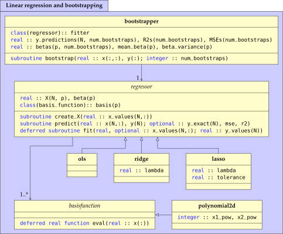

# ml1
First project in FYS-STK4155

# Prerequisites

- cmake
- wget
- python with numpy imageio tqdm scikit-learn
- asymptote
- fortran compiler (tested with gfortran and ifort)
- LAPACK, MKL or similar
- latexmk and lualatex
- pdf2svg

# Everything
`make -j`
